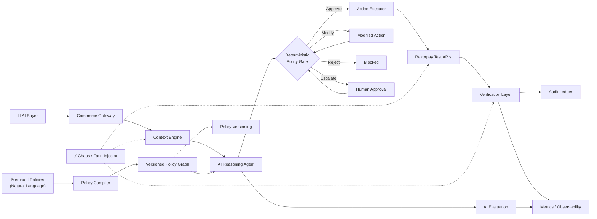
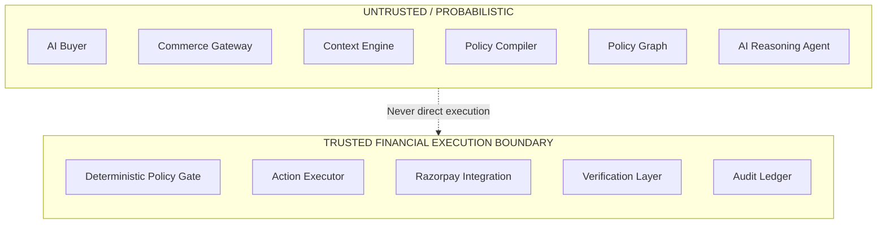
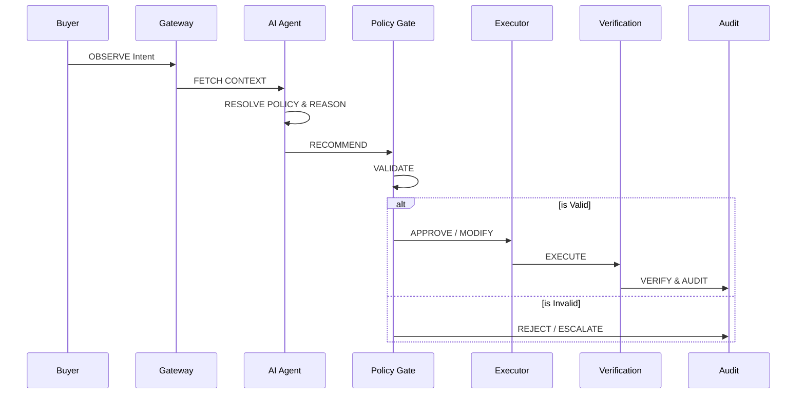
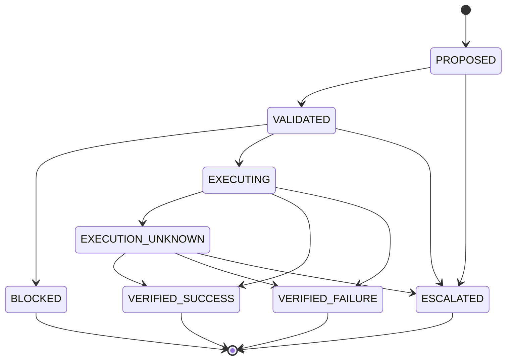

# Architecture

## Design goals

- **Policy correctness** — hard merchant constraints must be enforced deterministically.
- **Financial safety** — the LLM must remain outside the trusted financial execution boundary.
- **Bounded autonomy** — the agent can act only through explicit, least-privilege tools.
- **Recoverability** — uncertain external actions must be represented explicitly and verified before retry.
- **Observability** — every important decision and mutation must be traceable.
- **Idempotency** — duplicate requests must not create duplicate financial actions.
- **Versionability** — policy and model changes must be attributable to a decision.
- **Low operational complexity** — the hackathon implementation should be small enough to understand and reproduce.

## System context

## Component responsibilities

### 1. Commerce Gateway
* **Responsible for**: receiving buyer intent, normalizing commerce requests, assigning request and intent identifiers.
* **Not responsible for**: deciding whether a merchant policy is satisfied, direct payment authorization.

### 2. Context Engine
* **Responsible for**: retrieving authoritative product, price, inventory, customer, promotion and shipping context; attaching timestamps/version information; marking stale or unavailable context.
* **Not responsible for**: inventing missing values, deciding financial permissions.

### 3. Policy Compiler
* **Responsible for**: converting merchant natural-language policies into typed policy objects, detecting missing definitions, assigning policy versions, identifying unresolved ambiguity.
* **Not responsible for**: directly executing commerce actions.

### 4. Policy Graph
* **Responsible for**: storing policies, conditions, exceptions and precedence; exposing the applicable policy set for a transaction; preserving policy versions.
* **Not responsible for**: model reasoning, external payment mutation.

### 5. AI Reasoning Agent
* **Responsible for**: interpreting user intent, resolving contextual ambiguity, selecting read tools, producing an action recommendation, explaining policy conflicts concisely.
* **Not responsible for**: final authorization, arithmetic, payment state, inventory truth, direct database/payment mutation.

### 6. Deterministic Policy Gate
* **Responsible for**: enforcing hard constraints, validating calculations, validating permissions, checking approval thresholds, checking data freshness, rejecting actions that violate policy.
* **Not responsible for**: interpreting free-form user intent.

### 7. Action Executor
* **Responsible for**: executing an allowlisted action, generating idempotency keys, recording action state, routing external requests.
* **Not responsible for**: changing policy, bypassing the policy gate.

### 8. Razorpay Integration
* **Responsible for**: authenticated Test Mode API calls, Orders/payment-state operations used by the MVP, webhook intake.
* **Not responsible for**: merchant-policy reasoning.

### 9. Verification Layer
* **Responsible for**: querying authoritative state after external actions, resolving `EXECUTION_UNKNOWN`, confirming success or failure before retry.

### 10. Audit Ledger
* **Responsible for**: immutable decision records, policy IDs and versions, action IDs, model version, evidence references, execution result.

### 11. Human Approval Service
* **Responsible for**: presenting escalated cases, collecting a bounded approval/rejection decision, recording approver identity and reason.

### 12. Evaluation Harness
* **Responsible for**: generating/replaying benchmark scenarios, running baselines, measuring metrics, running failure injection.

## Trust boundaries

> [!IMPORTANT]
> The LLM is **never** part of the trusted financial execution boundary.

## Data flow

1. Buyer submits intent.
2. Commerce Gateway assigns `intent_id`.
3. Context Engine fetches authoritative data.
4. Policy Graph supplies the applicable versioned rules.
5. AI Agent produces a structured recommendation.
6. Deterministic Policy Gate rechecks all hard constraints.
7. System returns `APPROVE`, `MODIFY`, `REJECT` or `ESCALATE`.
8. Approved actions receive an `action_id` and idempotency key.
9. Action Executor calls Razorpay Test APIs where required.
10. Verification Layer confirms final state.
11. Audit Ledger records the full decision/result.

### Decision flow sequence

## State machine

### Why EXECUTION_UNKNOWN exists

A timeout only proves that the caller did not receive a response. It does not prove that the business action failed.

Therefore: **timeout ≠ failure**

The system must verify authoritative external state before retrying.

## Idempotency design

Every mutating intent has:
- `intent_id`
- `action_id`
- `idempotency_key`

A deterministic idempotency key is derived from the merchant, intent and action version.

**Duplicate requests:**
- do not create a new financial action
- return the existing action state
- retain the same audit chain

**Retries:**
- are allowed only after verification shows that the previous action did not succeed

## Consistency model

**Strongly authoritative**
- payment state
- inventory state
- merchant policy
- financial calculations
- action permissions

**Probabilistic**
- contextual classification
- ambiguity interpretation
- recommendation ranking
- concise explanation generation

> [!WARNING]
> A probabilistic result cannot override a deterministic prohibition.

## Failure domains

| Failure | Isolation / response |
| :--- | :--- |
| **AI unavailable** | fall back to bounded non-AI flow or escalate |
| **Inventory unavailable** | fail closed for inventory-sensitive actions |
| **Policy store unavailable** | block policy-dependent mutations |
| **Razorpay timeout** | `EXECUTION_UNKNOWN` → verify state |
| **Webhook delayed** | use API verification for critical state |
| **Webhook duplicate** | deduplicate event |
| **Network failure** | retry only within bounded/idempotent rules |
| **Database failure** | do not acknowledge mutation until durable state exists |

## Scalability direction

The MVP can remain synchronous and local. A larger deployment would evolve toward:
- stateless services
- queue/event-driven ingestion
- cached read context
- versioned policy artifacts
- asynchronous verification
- horizontal scaling
- durable audit storage
- separate evaluation traffic from production traffic

> [!NOTE]
> No production-scale capacity numbers are claimed by the MVP.

## Architecture decisions

| Decision | Why | Alternative rejected |
| :--- | :--- | :--- |
| **LLM outside execution boundary** | Model output is probabilistic | LLM directly calling payment APIs |
| **Typed Policy Graph** | Enables deterministic enforcement | Raw policy text at runtime |
| **Explicit EXECUTION_UNKNOWN** | Timeout is ambiguous | Treat timeout as failure |
| **Least-privilege tools** | Limits blast radius | Generic unrestricted tool |
| **Server-side Razorpay credentials** | Prevent secret exposure | Client-side secrets |
| **Verification after mutation** | External systems are asynchronous | Trusting API response alone |
| **Synthetic benchmark** | Reproducible and safe | Real customer data |