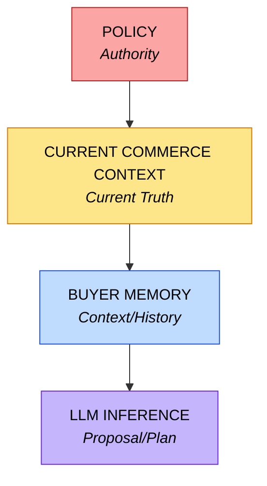
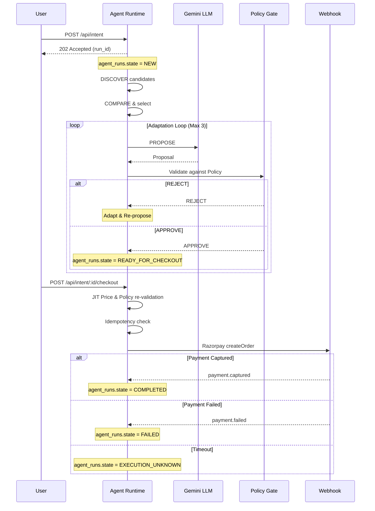
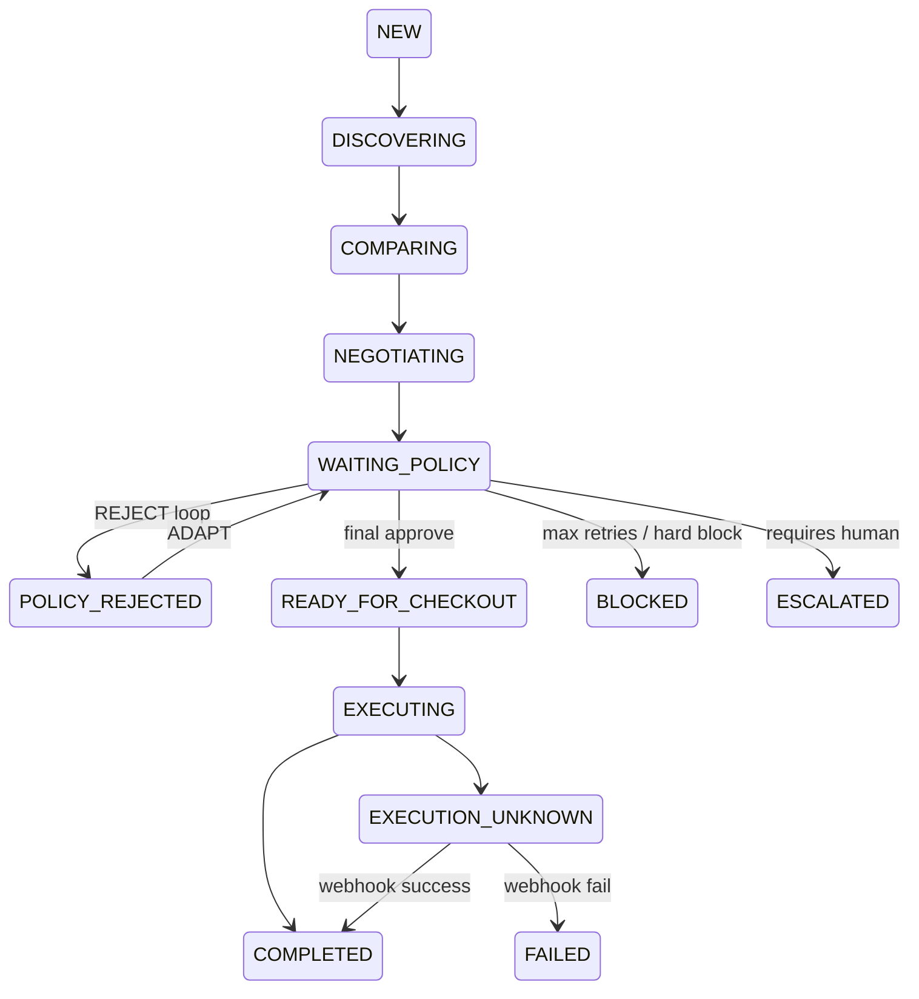
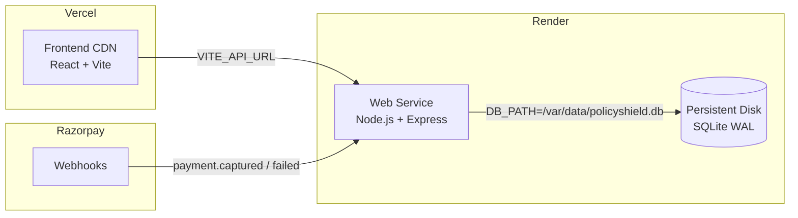

  <h1>🛡️ PolicyShield Architecture</h1>
  
PolicyShield strictly separates AI inference from authoritative state. The core philosophy is that AI should be allowed to reason and adapt, but the financial boundaries must remain completely deterministic and verifiable.

  <blockquote>
    <strong>The LLM proposes. The deterministic system decides. The event log proves what happened.</strong>
  </blockquote>

## The Trust Hierarchy

1. **MEMORY**: Contains explicit preferences and historical interactions. Memory is inherently stale and is *never* authoritative for price, inventory, promotions, policy, authorization, or payment state.
2. **COMMERCE CONTEXT**: The current truth. Prices and inventory fetched Just-In-Time (JIT) from the database before checkout validation.
3. **POLICY**: The merchant's hard business rules (e.g. `MAX_DISCOUNT`). It dictates what is permitted.
4. **RAZORPAY WEBHOOK**: The external payment truth. `payment.captured` is the only acceptable proof of payment success. `payment.failed` is the authoritative failure signal.

---

## The Agentic Flow

<b>Click to View Agentic Flow Diagram</b>

---

## Event-Driven State Machine

`agent_events` is the **immutable, append-only, sequence-numbered** record of every transition. The frontend polls it and renders it — it never infers state.

---

## Webhook State Machine

| Event | Action | agent_runs update |
|---|---|---|
| `payment.captured` | `actions.state → VERIFIED_SUCCESS` | `state → COMPLETED` + `VERIFIED_SUCCESS` agent_event |
| `payment.failed` | `actions.state → VERIFIED_FAILURE` | `state → FAILED` + `PAYMENT_FAILED` agent_event |
| `order.paid` | Recovery path for `EXECUTION_UNKNOWN` | Same as `payment.captured` |

All webhook processing is **idempotent** — duplicate events are silently ignored via `webhook_events.event_id` PRIMARY KEY.

---

## Frontend Architecture (3-Zone Console)

  

| Buyer Interface  *(Chat / intent)* | Immutable Event Log  *(append-only stream)* | Agent State  *(DB snapshot)* |
|:---|:---|:---|
| `POST /api/intent`   `202 → run_id` | `GET /events?after=N`   SSE stream | `GET /runs/:id`   SSE stream |
| `POST /checkout`   *(explicit confirm)* | expandable payload   sequence numbers   per-event type color | candidates   proposal   violations |

**The frontend is a renderer, not an agent.** It never infers state, never calculates business logic, and never holds authoritative data. `agent_runs.state` is the source of truth.

---

## System Resilience

- **Idempotency**: All operations bound to a strict `intent_id`. Duplicate POSTs return the existing action.
- **JIT Validation**: Prices and policy are re-validated at checkout time, not at proposal time.
- **Adaptation Loop**: LLM proposes → Policy rejects → LLM adapts (max 3 attempts). Model errors are contained deterministically.
- **Recovery**: `EXECUTION_UNKNOWN` states are resolved via `order.paid` / `payment.captured` webhooks on restart.
- **Memory Resilience**: If buyer memory is unavailable, the AI proceeds safely using only Commerce Context.

---

## Deployment Topology

### Razorpay Webhook Setup

1. Render Dashboard → copy your public URL (e.g. `https://policyshield-api.onrender.com`)
2. Razorpay Dashboard → **Settings → Webhooks → Add Webhook**
3. URL: `https://policyshield-api.onrender.com/api/webhooks/razorpay`
4. Enable events: `payment.captured` ✓ `payment.failed` ✓ `order.paid` ✓
5. Copy the Webhook Secret → set `RAZORPAY_WEBHOOK_SECRET` in Render env vars
