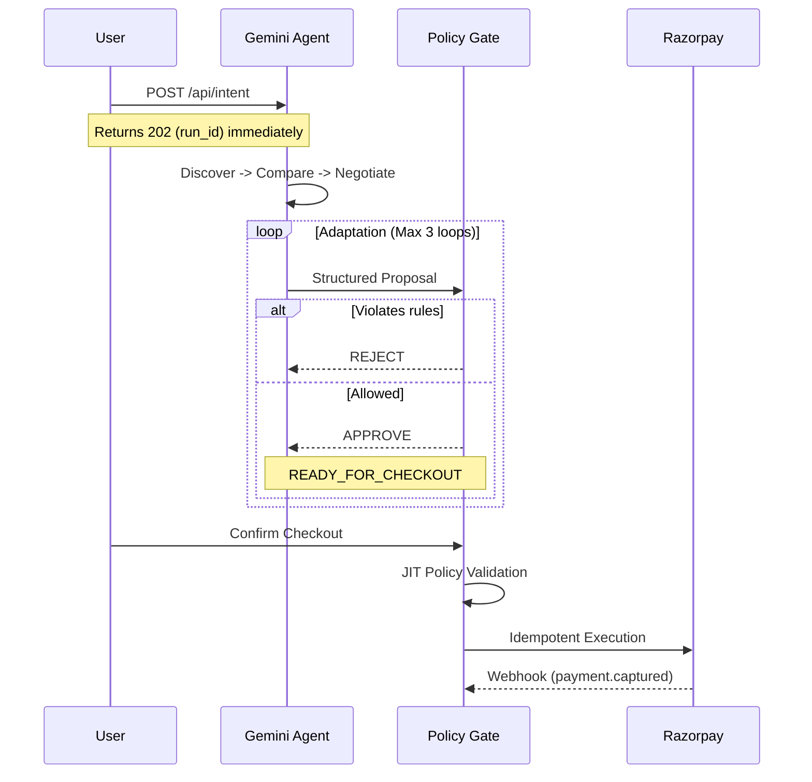

<div align="center">

<h1>🛡️ PolicyShield</h1>

<h3>AI Policy Compiler + Runtime Guard for Agentic Commerce</h3>

<p>
  <strong>The LLM proposes.</strong>
  &nbsp;•&nbsp;
  <strong>The deterministic system decides.</strong>
  &nbsp;•&nbsp;
  <strong>The event log proves what happened.</strong>
</p>

</div>

---

## The Problem

AI-native commerce lets agents buy on behalf of humans. That creates a risk boundary a normal LLM can violate:

| Policy | Rule |
|:---|:---|
| Premium products | Max discount = 5% |
| VIP customers | Max discount = 10% |
| Inventory | Keep 3 units as reserve |
| High-value orders | >₹50,000 requires human approval |

A generic AI agent can produce a perfectly reasonable-looking answer while violating all of the above — silently.

PolicyShield makes that impossible.

---

## Architecture

<details open>
<summary><b>Click to Expand Agent Architecture</b></summary>



</details>

**The invariant that never breaks:**
> No financial mutation (`VERIFIED_SUCCESS`) can happen without an `APPROVE` decision from the deterministic gate.

---

## Key Engineering Decisions

### 1. Event-Sourced State Machine

```sql
agent_runs     -- current truth (state, current_step, adaptation_count)
agent_events   -- immutable, append-only, sequence-numbered log
```

`agent_runs.state` is always the authoritative current state. The frontend never infers state from events — it reads `agent_runs`.

`agent_events` is the provable audit trail. `(run_id, sequence)` is UNIQUE with no gaps.

### 2. Adaptation Loop — model errors are contained

```
PROPOSE → POLICY_REJECT → ADAPT → PROPOSE (max 3 attempts)
```

If the LLM proposes a 20% discount on a product where policy allows 5%, the gate rejects it. The LLM adapts. The gate gets the final word. The adaptation count is visible in the UI and logged to `agent_events`.

### 3. JIT Validation — proposals can go stale

Prices and policies are re-validated at **checkout time**, not at proposal time. If a policy version changes between "READY_FOR_CHECKOUT" and "Confirm Checkout", the action is blocked and the run state becomes `FAILED`.

```sql
-- checked at checkout:
IF actions.policy_version != graph.version → BLOCK
```

### 4. Idempotency — replay-safe operations

Every action is keyed to `intent_id`:
```
idempotency_key = "idemp_{intent_id}"
external_receipt = sha256(idempotency_key)[0:36]
```

Duplicate POSTs return the existing action. Payment creation is replay-safe.

### 5. Webhook-First Verification

`payment.captured` (not `order.created`) is the only acceptable proof of payment success. `payment.failed` transitions the run to `FAILED` without manual intervention.

`EXECUTION_UNKNOWN` states (network timeout after Razorpay call) are recovered via `order.paid` webhook or startup recovery scan.

### 6. SSE Streaming — instant feedback

The frontend opens a `GET /api/v1/runs/:id/stream` Server-Sent Events connection immediately after `POST /api/intent`. Events arrive as they happen — no polling latency. The stream closes automatically on terminal state.

---

## Trust Boundary

| Decision | AI | Deterministic |
|:---|:---:|:---:|
| Understand buyer intent | ✅ | |
| Recommend approve/modify/reject | ✅ | |
| Calculate totals | | ✅ |
| Enforce discount ceiling | | ✅ |
| Verify inventory | | ✅ |
| Check permissions | | ✅ |
| Generate idempotency key | | ✅ |
| Execute financial mutation | | ✅ |
| Verify payment state | | ✅ |
| Audit mutation | | ✅ |

> The LLM is **never** part of the trusted financial execution boundary.

---

## Stack

| Layer | Technology |
|:---|:---|
| AI | Google Gemini 1.5 Flash |
| Backend | Node.js + Express + TypeScript |
| Database | SQLite (WAL mode, persistent disk on Render) |
| Payment | Razorpay (Test Mode) |
| Frontend | React + Vite + Tailwind |
| Deploy | Backend → Render, Frontend → Vercel |

---

## Running Locally

```bash
# Prerequisites: Node 18+, npm
git clone https://github.com/Tanish9022/PolicyShield
cd PolicyShield
cp .env.example .env
# Fill in: GEMINI_API_KEY, RAZORPAY_KEY_ID, RAZORPAY_KEY_SECRET

npm install
npm run dev          # starts backend on :3001
npm run dev:web      # starts frontend on :5173
```

Open `http://localhost:5173/buyer` → type a buying intent → watch the live event stream.

---

## Deployment

### Backend → Render

1. Connect repo → **New Web Service**
2. Build: `npm ci --workspace=services/backend && npm run build --workspace=services/backend`
3. Start: `node services/backend/dist/index.js`
4. Add Persistent Disk: mount `/var/data`, 1GB
5. Env vars: `DB_PATH=/var/data/policyshield.db`, `GEMINI_API_KEY`, `RAZORPAY_KEY_ID`, `RAZORPAY_KEY_SECRET`, `RAZORPAY_WEBHOOK_SECRET`, `DEV_MERCHANT_ID=merchant_1`

### Frontend → Vercel

1. Connect repo → New Project → Framework: **Vite** → Root Dir: `apps/web`
2. Env var: `VITE_API_URL=https://your-backend.onrender.com`

### Razorpay Webhooks

URL: `https://your-backend.onrender.com/api/webhooks/razorpay`

Enable: `payment.captured` ✓ `payment.failed` ✓ `order.paid` ✓

---

## Failure Paths (the "don't hide the ugly" principle)

| Scenario | Outcome |
|:---|:---|
| LLM proposes policy-violating discount | `POLICY_REJECT` → adapter loop → gate gets final word |
| LLM fails 3× adaptation attempts | `BLOCKED` state, reasons logged |
| Policy version changes during checkout | `JIT_FAILED`, action blocked |
| Razorpay call times out | `EXECUTION_UNKNOWN` → recovered by `order.paid` webhook or startup scan |
| `payment.failed` webhook fires | `agent_runs.state → FAILED`, event emitted |
| Duplicate intent submitted | Idempotency key collision → existing action returned |
| Cross-merchant request | 403 from auth middleware |