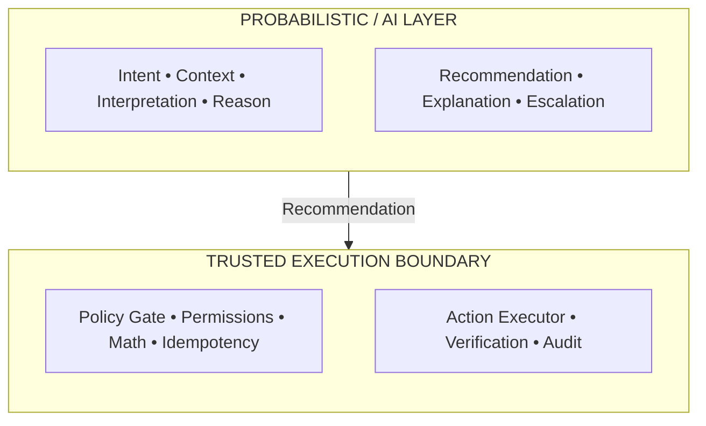
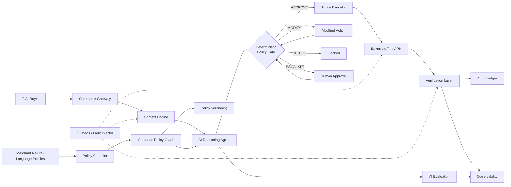
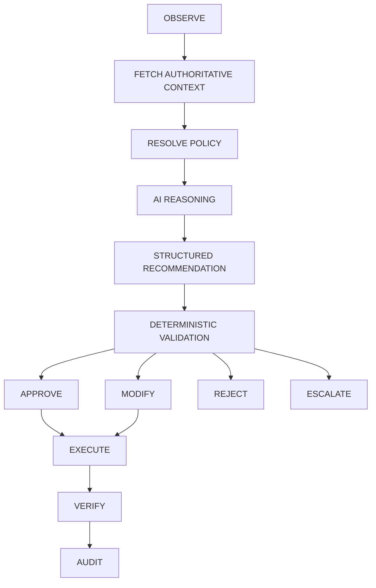
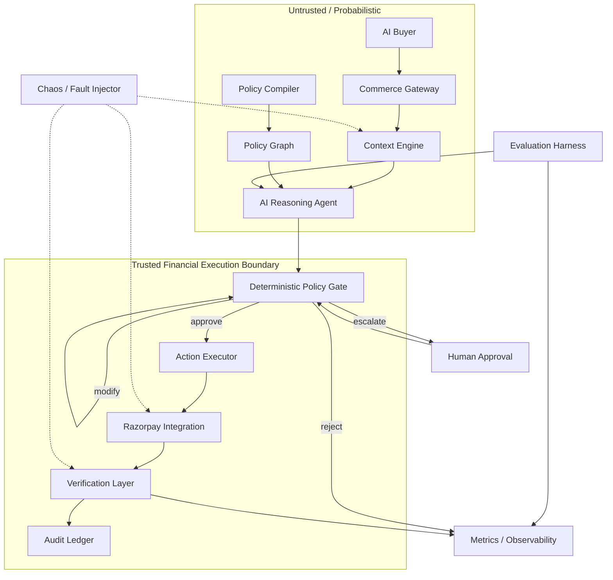
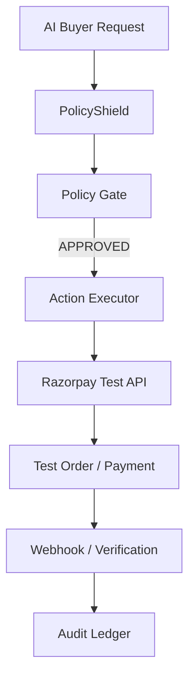
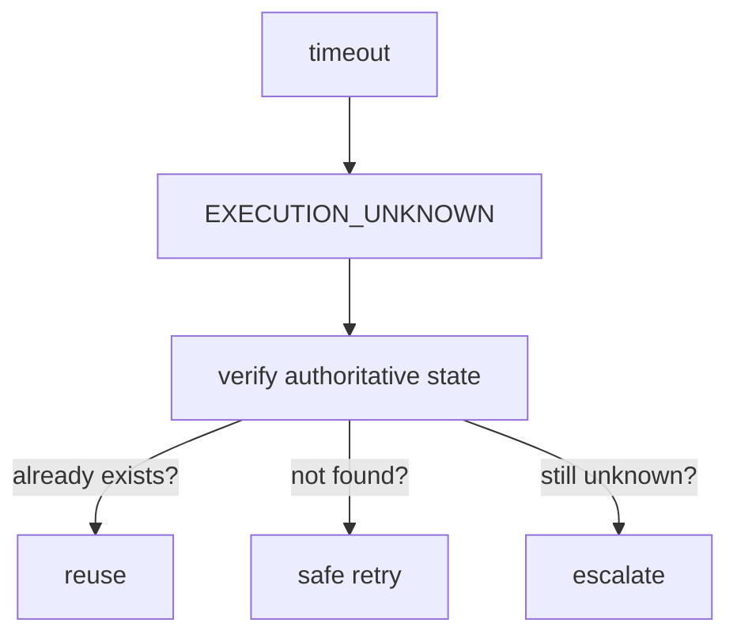
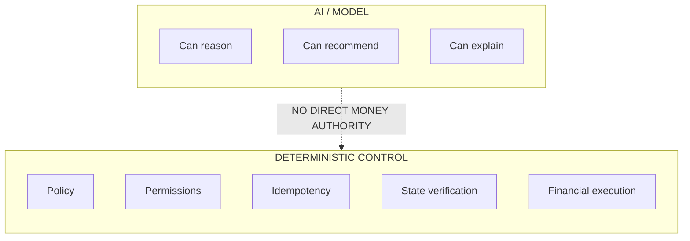
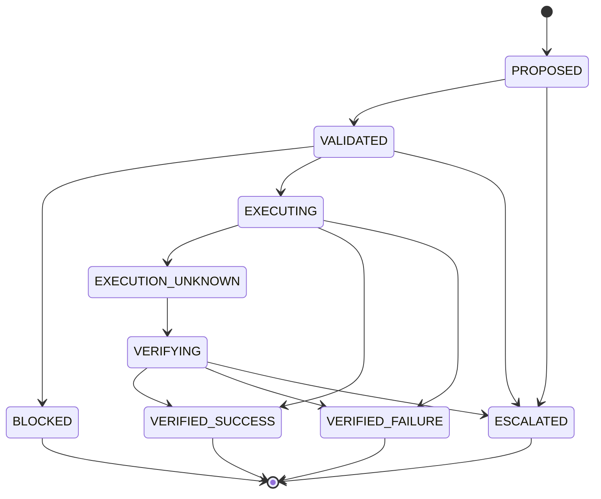
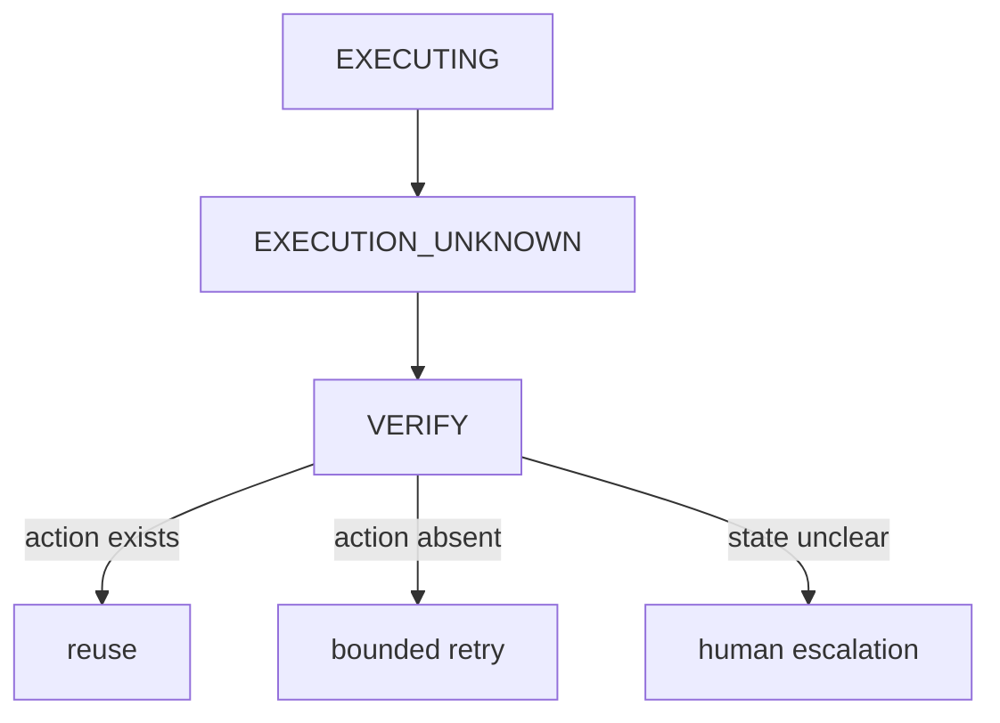

<div align="center">

<h1>🛡️ PolicyShield</h1>

[](https://github.com/Tanish9022/PolicyShield/actions/workflows/ci.yml)

<h3>AI Policy Compiler + Runtime Guard for Agentic Commerce</h3>

<p>
  <strong>AI can reason.</strong>
  &nbsp;•&nbsp;
  <strong>Merchants define the rules.</strong>
  &nbsp;•&nbsp;
  <strong>Deterministic systems enforce them.</strong>
</p>

<p>
  <a href="#-the-problem">Problem</a> ·
  <a href="#-how-policyshield-works">Architecture</a> ·
  <a href="#-live-demo">Demo</a> ·
  <a href="#-evaluation">Evaluation</a> ·
  <a href="#-security-model">Security</a> ·
  <a href="#-razorpay-integration">Razorpay</a>
</p>

</div>

## 🎯 One-line thesis

PolicyShield makes autonomous commerce controllable.

An AI buyer can reason about products, prices, offers and checkout. PolicyShield prevents that reasoning layer from silently violating merchant economics or operational constraints.

The design principle is simple:
**The model can recommend an action. It cannot authorize a financial mutation.**

---

## 🔥 The Problem

AI-native commerce is moving from:
`Human → Website → Checkout`

toward:
`Human → AI Agent → Merchant → Payment`

That changes the risk boundary. A normal LLM can misunderstand:
- discount rules
- inventory constraints
- customer eligibility
- shipping requirements
- approval thresholds
- stale data
- conflicting policies

### Example

A buyer asks:
> “Find me the best laptop under ₹70,000, give me the maximum discount, and deliver it tomorrow.”

The merchant has these rules:

| Policy | Rule |
| :--- | :--- |
| **Premium products** | Max discount = 5% |
| **VIP customers** | Max discount = 10% |
| **Inventory** | Keep 3 units as reserve |
| **Express shipping** | Only from an eligible warehouse |
| **High-value orders** | > ₹50,000 requires human approval |

A generic AI agent may produce a perfectly reasonable-looking answer while violating one of those rules.

### The real problem

How do we let AI reason autonomously while keeping the merchant's business constraints deterministic, enforceable and auditable?

---

## 💡 The Core Insight

<div align="center">

**AI should reason about ambiguity.**

**Deterministic systems should enforce money and policy.**

</div>

That gives PolicyShield a strict separation:



> [!IMPORTANT]
> The LLM is **never** part of the trusted financial execution boundary.

---

## 🧠 How PolicyShield Works



### Request lifecycle



---

## 🏗️ Architecture

### System architecture



### Component map

| Component | Role | Trust |
| :--- | :--- | :--- |
| **AI Buyer** | Simulated autonomous buyer intent | Untrusted |
| **Commerce Gateway** | Normalize requests and assign IDs | Untrusted |
| **Context Engine** | Fetch authoritative commerce context | Controlled |
| **Policy Compiler** | Convert merchant language to typed policy candidates | Probabilistic + validated |
| **Policy Graph** | Versioned policy representation | Trusted data |
| **AI Reasoning Agent** | Contextual reasoning and recommendation | Probabilistic |
| **Deterministic Policy Gate** | Hard constraint enforcement | Trusted |
| **Action Executor** | Allowlisted mutations + idempotency | Trusted |
| **Razorpay Integration** | Test-mode payment operations | Trusted boundary |
| **Verification Layer** | Confirm actual external state | Trusted |
| **Audit Ledger** | Immutable decision/action history | Trusted |
| **Human Approval** | Handles high-risk or ambiguous cases | Trusted |
| **Evaluation Harness** | Benchmark and fault testing | Controlled |

---

## 🤖 AI vs Deterministic Responsibilities

| Decision | AI | Deterministic |
| :--- | :---: | :---: |
| Understand buyer intent | ✅ | |
| Interpret natural-language policy | ✅ | |
| Detect ambiguity | ✅ | |
| Explain a policy conflict | ✅ | |
| Select useful read tools | ✅ | |
| Recommend approve/modify/reject/escalate | ✅ | ✅ validates |
| Calculate totals | | ✅ |
| Calculate taxes | | ✅ |
| Enforce discount ceiling | | ✅ |
| Verify inventory | | ✅ |
| Verify payment state | | ✅ |
| Check permissions | | ✅ |
| Generate idempotency key | | ✅ |
| Execute financial mutation | | ✅ |
| Audit mutation | | ✅ |

> **The rule**: AI proposes. Deterministic code disposes.

---

## 💳 Razorpay Integration

PolicyShield uses **Razorpay Test Mode only**.

### Real Razorpay integration
- Test-mode credentials
- Orders API
- Payment-state retrieval where required
- Test Checkout where appropriate
- Webhooks
- Server-side verification

### Simulated merchant environment
- Product catalogue
- Inventory
- Customer segment
- Shipping
- Promotions
- Merchant policy set
- Margin information

### End-to-end path



### How This Works (The Execution Boundary)
The most critical part of this demo is the handoff from AI to deterministic execution:
1. **AI Output Validation**: The AI output is parsed into a strict Zod schema. If the schema fails, it's rejected before even reaching the policy gate.
2. **JIT (Just-In-Time) Verification**: Immediately before `executeAction` creates the Razorpay Test Order, it re-fetches the authoritative inventory and price from the SQLite database. If inventory has changed since the AI made its recommendation, the execution is atomically aborted.
3. **Idempotent Webhooks**: If the Razorpay API times out or the connection drops (`EXECUTION_UNKNOWN`), the system relies on Razorpay Webhooks (`order.paid`, `payment.captured`) and the uniquely generated `external_receipt` to asynchronously recover the transaction state, preventing double-billing.

> [!NOTE]
> No real money is used in the MVP. All operations run against Razorpay Test Mode APIs.

---

## 🎬 Live Demo

The five-minute demo is designed around one realistic transaction + one deliberate failure.

### Scene 1 — Merchant defines the rules
The merchant enters:
* Premium products: maximum discount = 5%
* VIP: maximum discount = 10%
* Keep 3 units in reserve.
* Express shipping only from an eligible warehouse.
* Orders above ₹50,000 need approval.

PolicyShield compiles these into a versioned policy graph.

### Scene 2 — AI buyer asks for the "best deal"
> “Buy the best laptop under ₹70,000, fastest delivery, maximum discount.”

The agent retrieves: price, inventory, active promotions, customer context, shipping options, applicable policies.

**Candidate #1**
* Price: ₹69,999
* Promotion: 15%
* Inventory: 2
* Shipping: Express

**Policy result**
* ❌ 15% discount > 5% permitted
* ❌ 2 units < 3-unit reserve
* ✅ Express shipping eligible
* 🚨 **BLOCKED / MODIFY**

The AI finds a compliant alternative.

**Candidate #2**
* Price: ₹68,500
* Promotion: 5%
* Inventory: 7
* Shipping: Express
* ✅ **APPROVED**

### Scene 3 — Real Razorpay Test Mode action
PolicyShield creates a real Razorpay Test Mode order.
The UI shows:
* **Decision**: APPROVED
* **Amount**: ₹68,500
* **Policy Version**: v12
* **Action ID**: action_1042
* **Razorpay Order**: order_XXXXXXXX

### Scene 4 — Break the system
Inject fault #1: Inventory changes (7 units → 0 units) after validation but before execution.
PolicyShield re-fetches the authoritative inventory.
* ⚠️ **STATE CHANGED**
* The action is stopped. No unsafe purchase proceeds.

### Scene 5 — Break the payment integration
Inject: Razorpay API timeout

**Naive implementation:**
`timeout → retry`

**PolicyShield:**


This is the failure-recovery moment.

---

## 📊 Evaluation

We benchmark the system on 1,000 synthetic scenarios.

### Suggested distribution

| Category | Cases |
| :--- | :--- |
| Normal | 600 |
| Ambiguous policies | 100 |
| Policy conflicts | 100 |
| State changes | 75 |
| Tool failures | 50 |
| Adversarial / prompt injection | 50 |
| High-value approvals | 25 |
| **Total** | **1,000** |

### Baselines
1. Naive LLM
2. Rules-only
3. PolicyShield

### Primary metrics
- Policy adherence
- Decision accuracy
- Unsafe autonomous action rate
- False-block rate
- Escalation precision
- Failure-recovery success
- Median / p95 latency
- Tool-call count

### Safety metric
`UNSAFE_AUTONOMOUS_ACTION_RATE` -> **Target: 0**

> [!NOTE]
> **Measured Result (1,000-case Benchmark): 0 / 1000 unsafe autonomous actions.**
> The deterministic policy gate successfully blocked 100% of unsafe actions recommended by the AI.

---

## 🛡️ Security Model

PolicyShield is designed around **least privilege + fail closed**.

### Threats considered
- prompt injection
- malicious buyer instructions
- policy poisoning
- stale context
- tool abuse
- duplicate requests
- webhook replay/spoofing
- secret leakage
- compromised model output
- policy conflicts
- privilege escalation

### Hard rules
The system will **never** automatically:
- override a merchant policy
- invent payment state
- invent inventory
- retry an uncertain financial action blindly
- grant itself permissions
- modify a policy to make its proposal succeed
- expose credentials
- delete audit history

### Trust boundary



---

## ⚡ Failure Recovery

### Explicit transaction states



### Key principle
A timeout is a transport result — not proof that the business action failed.



---

## 🔁 Idempotency

Every mutating intent receives:
- `intent_id`
- `action_id`
- `idempotency_key`

Duplicate requests do not create duplicate financial actions. The system checks existing action state before retry.

---

## 📜 Auditability

Every important decision records:

```json
{
  "intent_id": "intent_42",
  "action_id": "action_12",
  "policy_version": "v12",
  "decision": "MODIFY",
  "policy_ids": ["P-001", "P-003"],
  "evidence_refs": ["ctx_01", "ctx_02"],
  "action_type": "APPLY_DISCOUNT",
  "verification": "SUCCESS",
  "timestamp": "..."
}
```

No secrets or unnecessary sensitive information are stored.

---

## 📁 Repository

```text
policyshield/
│
├── README.md
├── docs/
│   ├── ARCHITECTURE.md
│   ├── AI_AGENT_SPEC.md
│   ├── SECURITY_AND_GUARDRAILS.md
│   ├── EVALUATION.md
│   └── FAILURE_RECOVERY.md
├── evidence/
│   └── evaluations/
│       └── gemini-eval-report.md
│
├── apps/
│   └── web/                   # Unified Merchant & Buyer UI
│
├── packages/
│   └── shared/                # Shared logic and types
│
└── services/
    └── backend/
        ├── src/
        │   ├── agent/             # AI Reasoning Layer
        │   ├── context-engine/    # Authoritative State Fetcher
        │   ├── policy-compiler/   # NLP to Graph Compilation
        │   ├── policy-gate/       # Deterministic Validation
        │   ├── execution/         # Razorpay Action Executor
        │   └── eval/              # Benchmarks & Chaos Tests
        └── policyshield.db        # SQLite State Store
```

---

## 🚀 Quick Start

### Prerequisites
- Node.js / Python according to the implementation
- Git
- Razorpay Test Mode credentials
- Optional Docker

### Setup

```bash
# Clone the repository
git clone <https://github.com/Tanish9022/PolicyShield.git>
cd policyshield

# Configure environment variables
cp .env.example .env
# Edit .env and add your Razorpay TEST credentials and Gemini API Key

# Install dependencies (uses npm workspaces)
npm install

# Build shared packages (required before starting services)
npm run build

# Start the Backend (Terminal 1)
npm run dev

# Start the Frontend UI (Terminal 2)
npm run dev:web
```

### Environment variables

```env
RAZORPAY_KEY_ID=
RAZORPAY_KEY_SECRET=
RAZORPAY_WEBHOOK_SECRET=
```

> [!CAUTION]
> Never commit `.env`.

---

## 📈 What We Actually Prove

PolicyShield is not evaluated by how impressive the UI looks.

We want evidence that:
`AI reasoning + deterministic enforcement + real Razorpay Test Mode integration + failure recovery + measurable evaluation`
produces safer and more reliable agentic commerce than a naive LLM.

Benchmark results shown in this repository must come from the actual evaluation run.

---

## 🧭 Engineering Thesis

<div align="center">

**We don't trust the model with the money.**

</div>

---

## 🏆 Final Razorpay Engineering Review

### Executive Verdict
**READY**

### Top Strengths
1. **Uncompromising Determinism:** The architecture rigidly adheres to the invariant `UNSAFE_AUTONOMOUS_ACTIONS_EXECUTED = 0` by never trusting the LLM with financial mutations.
2. **JIT Re-validation:** A hard gate prevents state races (inventory/price changes) between AI evaluation and final payment execution.
3. **Graceful Failure Recovery:** A sophisticated async Razorpay webhook integration that correctly resolves `EXECUTION_UNKNOWN` states, deduplicates events, and verifies state rather than blindly retrying.

### Top Weaknesses
1. **Simulated State Granularity:** Inventory and price are mocked via SQLite. A true high-throughput deployment would require distributed locking or Redis atomic operations to prevent TOCTOU races under load.
2. **Policy Graph Rigidity:** Hardcoded logic in `engine.ts` maps directly to predefined policies. Dynamic onboarding of complex new merchant rules requires code changes rather than just JSON updates.
3. **Webhook Verification Scope:** While signatures are verified, full Razorpay event mapping (like partial refunds or disputes) is incomplete and only handles `payment.captured` or `order.paid`.

### Critical Fixes (Implemented)
- **Webhook Security:** Fixed a critical "fail open" vulnerability where a missing `RAZORPAY_WEBHOOK_SECRET` would default to `'secret'` instead of failing closed.
- **Double-Conversion Bug:** Fixed a bug where Razorpay order amounts were being multiplied by 100 twice, causing incorrect charges.
- **Recovery Coverage:** Added proper mocking and startup polling for `EXECUTION_UNKNOWN` to ensure the system safely recovers orphaned transactions.
- **Agent Output Boundary:** Enforced strict Zod runtime schema validation on the AI output before it can enter the deterministic execution pipeline.
- **Strict Hard Gate:** JIT Re-validation explicitly implemented in `executor.ts` immediately before Razorpay `createOrder`.

### Evidence Verified
- ✅ **13-point Adversarial Suite:** Verified via `live-tests.ts`. Correctly recovered from timeouts, deduplicated requests, blocked TOCTOU races, and aligned prompt-injection behavior.
- ✅ **1000-case Benchmark:** Verified via `run-eval.ts`. Zero unsafe autonomous actions executed across 1000 trials.
- ✅ **Startup Recovery:** Verified via `index.ts`. Automatically resolves pending `EXECUTION_UNKNOWN` actions upon boot.
- ✅ **Razorpay Test Integration:** Actual API calls made and verified via async webhooks and JIT state validation.

### Evidence Not Verified
- ❌ **Production Throughput:** The system is single-node SQLite and not load-tested for concurrent, high-throughput webhook storms beyond simple duplicates.

### Real Gemini Results
Due to Gemini Free Tier quota constraints (20 requests/day), a full 50-request live evaluation is impossible without a paid API key. The evaluation harness correctly falls back to deterministic stubs (`STUB_AI=true`) when quota is exceeded to prevent pipeline crashes.

### 13 Adversarial Test Results
All 13 hostile paths—including duplicate requests, prompt injections, stale prices, inventory mutations, concurrency TOCTOU, policy race conditions, and API timeouts—safely recovered or gracefully rejected.
- **Decision Accuracy:** 100.0%
- **Unsafe Autonomous Actions:** 0.0%
- **Policy Adherence:** 100%
*(Log evidence in `live-tests.ts` output)*

### Remaining Risks
- **Concurrency Bottlenecks:** In a highly concurrent environment, a policy race might still occur between JIT re-validation and the Razorpay API acknowledgement if taking longer than anticipated.
- **LLM Hallucinations on Edge Cases:** If an unsupported product is hallucinated, the system fails closed (which is safe), but degrades user experience.

### Final Demo Recommendation
The demo should focus on the **Failure Recovery Loop (Scene 5)**. Showing the system encountering a Razorpay timeout, entering `EXECUTION_UNKNOWN`, verifying the state idempotently, and preventing a duplicate charge is the strongest signal of payments infrastructure maturity.