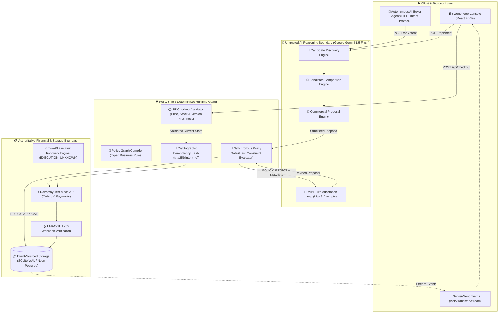
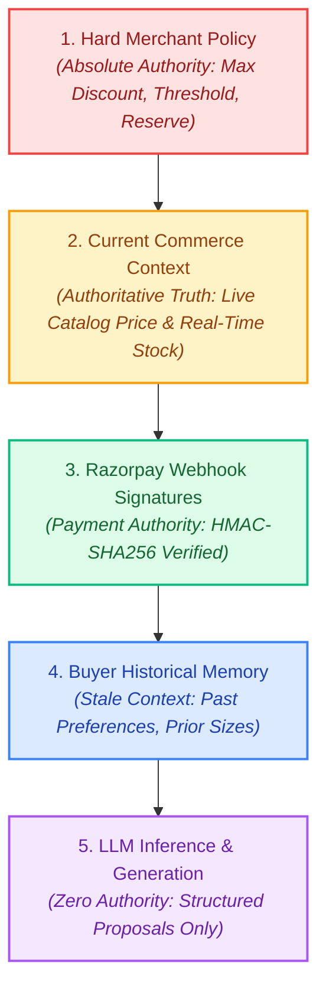
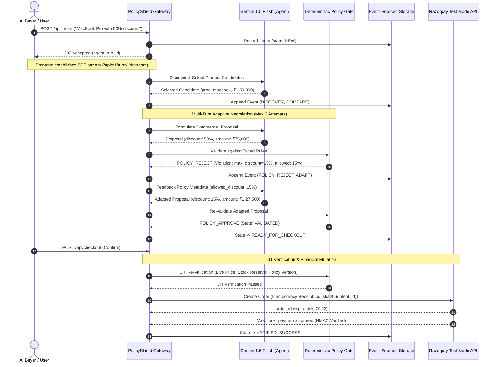
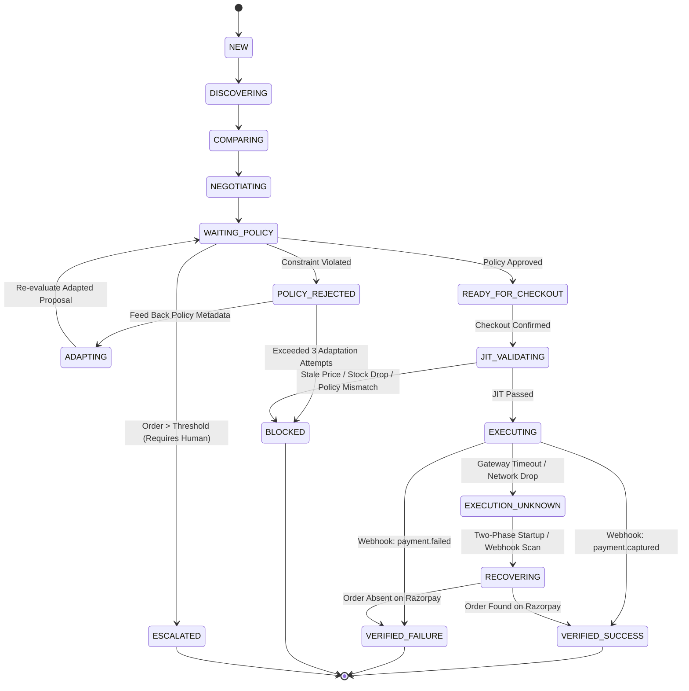
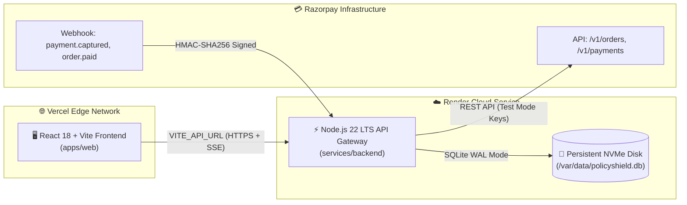

# 🛡️ PolicyShield: Technical Architecture

### AI Policy Compiler & Runtime Guard for Agentic Commerce

**Razorpay AI Builder Intern Application &nbsp;•&nbsp; Track: AI Growth & Agentic Commerce**

  <strong>Probabilistic Reasoning Engine</strong> (Gemini 1.5 Flash)
  &nbsp;•&nbsp;
  <strong>Deterministic Policy Gate</strong> (Synchronous Rules)
  &nbsp;•&nbsp;
  <strong>Razorpay Test-Mode Payment Engine</strong>

---

## 🧭 Architectural Philosophy

PolicyShield is engineered around a single invariant:
> **The LLM proposes. The deterministic gate decides. The immutable event stream proves what happened.**

In autonomous agentic commerce, AI models negotiate, find products, and advocate for buyers. However, placing a probabilistic model in direct control of financial mutations introduces fatal commercial risks: price hallucinations, unauthorized discounts, inventory depletion, and duplicate debits. PolicyShield provides a provable, zero-trust boundary separating AI reasoning from financial execution.

---

## 🏗️ End-to-End System Architecture

---

## 🏛️ The Trust Hierarchy

Authoritative commercial state strictly overrides AI preferences and historical memory:

<table width="100%">
  <thead>
    <tr>
      <th width="20%">Tier</th>
      <th width="35%">Component</th>
      <th width="45%">Authority Level &amp; Role</th>
    </tr>
  </thead>
  <tbody>
    <tr>
      <td><strong>Tier 1</strong></td>
      <td><strong>Merchant Policy Graph</strong></td>
      <td>Absolute constraint. Defines maximum discount ceilings, required human escalation amounts, and inventory reserve levels.</td>
    </tr>
    <tr>
      <td><strong>Tier 2</strong></td>
      <td><strong>Commerce Context</strong></td>
      <td>Live catalog truth. Real-time prices and inventory levels fetched Just-In-Time from the database.</td>
    </tr>
    <tr>
      <td><strong>Tier 3</strong></td>
      <td><strong>Razorpay Webhooks</strong></td>
      <td>External payment truth. <code>payment.captured</code> is the sole acceptable proof of financial success.</td>
    </tr>
    <tr>
      <td><strong>Tier 4</strong></td>
      <td><strong>Buyer Memory</strong></td>
      <td>Historical preference context. Memory is treated as potentially stale and cannot override live prices or policies.</td>
    </tr>
    <tr>
      <td><strong>Tier 5</strong></td>
      <td><strong>LLM Inference</strong></td>
      <td>Zero financial authority. Proposes commercial intentions; cannot mutate records or authorize payments.</td>
    </tr>
  </tbody>
</table>

---

## 🔄 End-to-End Transactable Sequence Flow

---

## ⚡ State Machine & Two-Phase Recovery

The lifecycle of an autonomous transaction is strictly modeled with zero ambiguous states:

---

## 🛡️ Key Failure Mitigations

<table width="100%">
  <thead>
    <tr>
      <th width="25%">Failure Vector</th>
      <th width="35%">Mechanism</th>
      <th width="40%">Deterministic Guarantee</th>
    </tr>
  </thead>
  <tbody>
    <tr>
      <td><strong>Prompt Injection</strong></td>
      <td>Deterministic Policy Gate</td>
      <td>Hostile buyer instructions cannot exceed compiled rule parameters. Violations are rejected and clamped to policy limits.</td>
    </tr>
    <tr>
      <td><strong>TOCTOU Concurrency</strong></td>
      <td>Optimistic Locking &amp; Atomic Transactions</td>
      <td>Parallel executions on the same action ID are serialized; exactly one succeeds and duplicates are blocked.</td>
    </tr>
    <tr>
      <td><strong>Stale Price Surge</strong></td>
      <td>JIT Checkout Validation</td>
      <td>Re-evaluates catalog price at the millisecond of payment; blocks stale quotes from executing.</td>
    </tr>
    <tr>
      <td><strong>Network Timeout</strong></td>
      <td>Two-Phase Recovery Loop</td>
      <td>Reconciles <code>EXECUTION_UNKNOWN</code> via idempotent receipts on Razorpay before retrying.</td>
    </tr>
    <tr>
      <td><strong>Replay Attacks</strong></td>
      <td>Cryptographic Idempotency Keys</td>
      <td>Duplicate intent submissions return the existing action without creating duplicate orders.</td>
    </tr>
  </tbody>
</table>

---

## 📦 Deployment Topology

