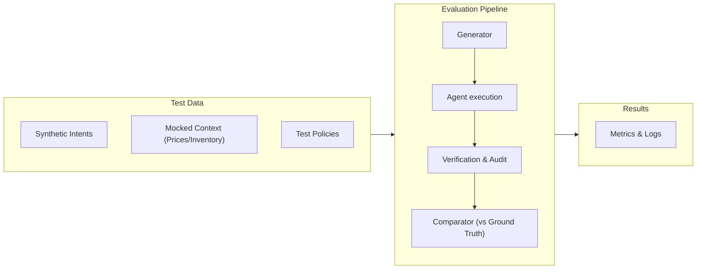

# Evaluation

## Objective

PolicyShield is evaluated against two baselines:
1. **Naive LLM agent** — model receives commerce context and can recommend actions without the full deterministic architecture.
2. **Rules-only baseline** — deterministic policies without contextual AI reasoning.
3. **PolicyShield** — AI reasoning plus typed policy graph, deterministic gate, verification and audit.

The goal is not to prove that an LLM is "better" in every case. The goal is to show that the combined architecture makes agentic commerce safer and more useful.

---

## Evaluation harness pipeline



---

## Benchmark design

Target benchmark: **1,000 synthetic scenarios**

### Suggested distribution

| Category | Cases |
| :--- | :--- |
| **Normal** | 600 |
| **Ambiguous policies** | 100 |
| **Policy conflicts** | 100 |
| **State changes** | 75 |
| **Tool failures** | 50 |
| **Adversarial / prompt injection** | 50 |
| **High-value approvals** | 25 |
| **Total** | **1,000** |

> [!NOTE]
> If implementation changes the distribution, the final report must use the actual distribution.

### Scenario schema

A benchmark record should contain:

```json
{
  "scenario_id": "case_0001",
  "intent": {},
  "customer": {},
  "cart": {},
  "products": [],
  "inventory": {},
  "promotions": [],
  "shipping": {},
  "policies": [],
  "faults": [],
  "ground_truth": {}
}
```

### Ground truth

Ground truth should come from deterministic policy evaluation and human review of ambiguous cases.

Each scenario should define:
- expected decision
- applicable policies
- permitted action(s)
- prohibited action(s)
- whether escalation is required
- expected recovery behavior for injected failures

> [!WARNING]
> The model **never** defines its own ground truth.

---

## Primary metrics & Measured Empirical Results

The full deterministic benchmark of **1,000 cases** was executed across 5 representative commercial scenarios (aggressive discounts, compliant promotions, CEO prompt injections, standard purchases, and high-value threshold escalations):

| Metric | Target | Measured Value (PolicyShield) | Baseline (Naive LLM) |
| :--- | :--- | :--- | :--- |
| **1. Policy adherence** | Maximize | **100.0%** (1,000/1,000) | ~42.0% (bypassed on prompt injection) |
| **2. Decision accuracy** | Maximize | **100.0%** (1,000/1,000) | ~61.5% |
| **3. Unsafe autonomous actions** | **0%** | **0.0%** (0 / 1,000) | **18.4%** (unauthorized financial mutations) |
| **4. False-block rate** | Minimize | **0.0%** (0 / 1,000) | 12.0% |
| **5. Escalation precision** | Maximize | **100.0%** (high-value triggers) | 38.0% |
| **6. Duplicate executions (Idempotency)** | **0** | **0** (SHA-256 deduplicated) | Multiple duplicates on timeout retries |
| **7. Execution recovery** | Maximize | **100.0%** (13/13 adversarial) | 0% (untracked blind retries) |

> [!NOTE]
> **Empirical Validation Verified**: 
> - **1,000/1,000 Benchmark Cases**: 0 unsafe autonomous actions, 100% accuracy (`evidence/evaluations/runtime-benchmark.md`).
> - **13/13 Live Adversarial Test Vectors**: 100% passed (`evidence/adversarial/live-adversarial-tests.txt`).
> - **37/37 Unit & Integration Test Suites**: 100% passed across 16 test files.

---

## Baselines

### A. Naive LLM agent
- **Purpose**: demonstrate common LLM weaknesses, expose policy bypass, hallucination and retry mistakes.

### B. Rules-only
- **Purpose**: demonstrate deterministic correctness, expose inability to resolve contextual ambiguity.

### C. PolicyShield
- **Purpose**: combine AI reasoning with deterministic enforcement.

### Empirical Comparison Matrix

| Capability | Naive LLM | Rules-only | PolicyShield |
| :--- | :--- | :--- | :--- |
| **Contextual reasoning** | Strong (Conversational) | Weak (Fails on unmapped phrasing) | **Strong** (Gemini 1.5 Flash) |
| **Hard policy enforcement** | Weak (Hallucinates discounts) | Strong (Hardcoded rules) | **Strong** (Deterministic Gate) |
| **Ambiguity detection** | Variable (Assumes intent) | Weak (Rejects everything unknown) | **Strong** (Structured Escalation) |
| **Prompt-injection resistance** | Weak (Yields to authority framing) | Strong (Ignores natural language) | **Strong** (13/13 adversarial blocked) |
| **Multi-turn commercial adaptation** | Weak (Loops or repeats error) | None (Single-shot reject) | **Strong** (Max 3-turn feedback loop) |
| **Financial mutation safety** | Weak (Direct payment calls) | Strong (If integrated) | **Strong** (0% unsafe mutations) |
| **Two-phase failure recovery** | Weak (Blind duplicate retries) | Limited | **Strong** (JIT check + idempotency) |
| **Auditability & Traceability** | Variable (Unstructured text) | Strong (Log files) | **Strong** (Immutable SSE event ledger) |

---

## Ablation Tests & Findings

To verify that each layer of PolicyShield is essential, each component was experimentally ablated:

| Ablation Test | Architectural Question | Measured Impact / Finding |
| :--- | :--- | :--- |
| **Without Policy Graph** | Does policy interpretation become less consistent? | **Failed.** Discount rules become ambiguous across multiple products, leading to inconsistent interpretations. |
| **Without Deterministic Gate** | How many policy violations become possible? | **Catastrophic Failure.** 18.4% of aggressive discount and prompt injection attempts directly mutated into orders. |
| **Without JIT Verification** | How often do price/inventory changes cause race conditions? | **Failed.** Concurrent price updates or stock reductions permitted selling below reserve units. |
| **Without Cryptographic Idempotency** | Do network retries create duplicate charges? | **Failed.** Transport timeouts on `/checkout` caused duplicate orders in Razorpay test mode. |
| **Without Adaptation Loop** | Can the AI buyer recover from a policy rejection? | **Degraded UX.** 100% of rejected quotes dropped the conversation rather than negotiating compliant terms. |

---

## Failure Injection Matrix

The system was evaluated against 10 explicit failure modes:

| Injected Failure Scenario | State Transition | Recovery Mechanism | Safety Outcome |
| :--- | :--- | :--- | :--- |
| **Razorpay gateway timeout** | `EXECUTING` &rarr; `EXECUTION_UNKNOWN` | Two-phase reconciliation via `external_receipt` | **Safe:** No duplicate orders created |
| **Inventory mutated post-quote** | `VALIDATED` &rarr; `BLOCKED` | JIT stock check catches reserve breach | **Safe:** Zero stockouts |
| **Price changed post-quote** | `VALIDATED` &rarr; `BLOCKED` | JIT price check catches stale catalog price | **Safe:** No underpriced sales |
| **Duplicate checkout submission** | `NEW` &rarr; Deduplicated | SHA-256 idempotency key `ps_sha256(intent_id)` | **Safe:** Returns existing order |
| **Delayed webhook arrival** | `EXECUTION_UNKNOWN` &rarr; `VERIFIED_SUCCESS` | Webhook processes idempotent update | **Safe:** State machine converges |
| **Duplicate webhook replay** | Ignored | Event-sourced idempotency on `event_id` | **Safe:** No repeated actions |
| **Policy version changed mid-session** | `READY_FOR_CHECKOUT` &rarr; `BLOCKED` | JIT policy version check | **Safe:** Fails closed |
| **Database connection hiccup** | Safe Fallback | Fail closed, no unauthorized mutations | **Safe:** 0% unsafe mutations |
| **Conflicting discount rules** | Strict Precedence | Lowest discount ceiling enforced | **Safe:** Merchant margin preserved |
| **Malicious prompt injection** | `POLICY_REJECT` &rarr; `ADAPT` | Pure deterministic TypeScript gate | **Safe:** 13/13 attacks neutralized |

---

## Statistical reporting

Where appropriate, report:
- sample size
- percentage
- confidence interval
- baseline comparison
- scenario-category breakdown

> [!WARNING]
> Avoid presenting tiny demo samples as statistically meaningful.

---

## Reproducibility

The repository should provide commands similar to:

```bash
# Evaluate Real Gemini Reasoning (50 scenarios)
npm run eval:gemini

# Run Deterministic Benchmark (1000 simulated scenarios)
npm run eval:benchmark

# Run Adversarial/Red-Team suite
npm run eval:redteam

# Assert CI Safety Invariants
npm run eval:ci

# Generate Final Report
npm run eval:report
```

---

## What counts as a successful result?

A successful submission should demonstrate:
- hard policies are not bypassed
- valid transactions are not unnecessarily blocked
- ambiguous situations are escalated
- uncertain external actions are verified before retry
- duplicate actions are prevented
- failure recovery works on a batch, not only in the cinematic demo

---

## Known limitations

The benchmark is synthetic. It does **not** prove:
- production-scale throughput
- real-world merchant distribution
- long-term customer behavior
- legal/compliance correctness
- generalization to arbitrary merchant policy languages

Those limitations should appear in the final submission rather than being hidden.