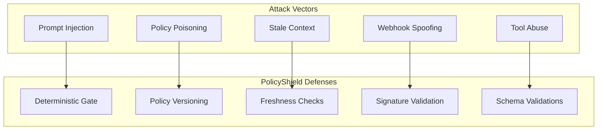
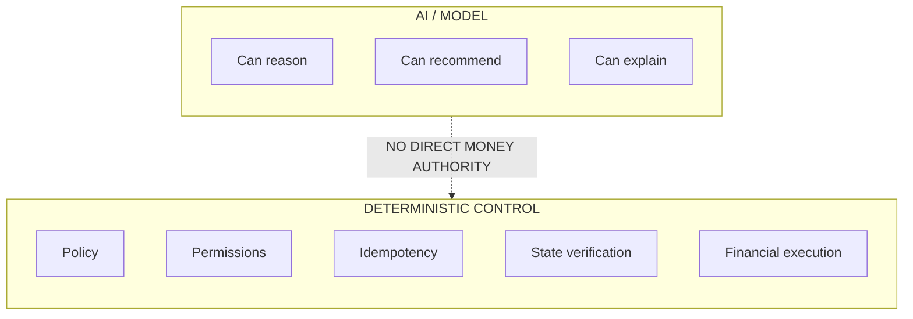

<div align="center">
  <h1>🛡️ PolicyShield Security & Guardrails</h1>
  <p><strong>Razorpay AI Builder Intern Application &nbsp;•&nbsp; Track: AI Growth & Agentic Commerce</strong></p>
  <p>Ensuring probabilistic AI components cannot independently execute unsafe financial mutations.</p>
</div>

## Security principles

- **Least privilege**
- **Deterministic financial controls**
- **Fail closed for dangerous actions**
- **Verify uncertain external state**
- **Immutable/auditable decisions**
- **Separation of reasoning and execution**

---

## Threat model



| Threat | Impact | Mitigation | Detection |
| :--- | :--- | :--- | :--- |
| **Prompt injection** | Agent attempts to violate merchant policy | Policy hierarchy + deterministic gate | policy conflict reason code |
| **Malicious buyer** | Unauthorized discount/action | Buyer text cannot modify policy | blocked-action logs |
| **Policy poisoning** | Unsafe merchant rule | Policy versioning + approval | policy change audit |
| **Stale data** | Wrong inventory/price decision | freshness checks + re-fetch | stale-context metrics |
| **Tool abuse** | Unauthorized mutation | allowlisted tools + schemas | tool audit |
| **Replay** | Duplicate financial action | idempotency + action IDs | duplicate-key events |
| **Duplicate request**| Double execution | idempotency | action deduplication |
| **Webhook spoofing** | False state transition | signature verification | verification failure logs |
| **Secret leakage** | Credential compromise | backend-only secret storage | secret scanning |
| **Compromised AI output**| Unsafe action | deterministic gate | policy gate rejection |
| **Policy conflict** | Incorrect decision | explicit precedence/escalation | conflict classification |
| **Privilege escalation** | Agent gains broader authority | fixed role capabilities | authorization audit |

---

## Permission model

### Agent
**Can:**
- read permitted commerce context
- propose actions
- request approval
- call explicitly allowed read tools

**Cannot:**
- modify policy
- grant permissions
- access secrets
- bypass deterministic validation
- directly execute unrestricted financial mutation

### Merchant
**Can:**
- create/update policies
- define thresholds
- define approval requirements
- review audit records

### Human approver
**Can:**
- approve/reject escalated actions within configured scope

**Cannot:**
- remove immutable audit history

### System
**Can:**
- execute actions that passed authorization and policy checks
- verify external state
- record audit events

---

## Financial guardrails

Hard controls include:
- maximum transaction threshold
- maximum discount
- approval threshold
- action allowlist
- idempotency
- state verification
- policy version validation
- data freshness validation

The following hierarchy applies:

`Policy restriction > Agent recommendation`

> [!WARNING]
> Confidence cannot override a prohibition.

---

## Webhook security

The webhook layer must implement:
- signature verification
- replay protection
- idempotent event handling
- event persistence
- out-of-order tolerance
- authoritative API verification for critical state

> [!CAUTION]
> Webhook payloads are treated as untrusted input until verified.

---

## Secrets

Razorpay credentials must be:
- stored in environment variables or an approved secret store
- accessible only to the backend integration
- excluded from Git history
- excluded from logs
- excluded from model context
- excluded from screenshots

> [!IMPORTANT]
> Only `.env.example` is committed.

---

## Trust boundary



---

## Fail-closed rules

The system will **never** automatically:
- override a hard merchant policy
- approve a policy conflict without deterministic precedence
- retry an uncertain financial action without state verification
- execute above the merchant's approval threshold
- invent payment or inventory state
- modify policy to make its own action succeed
- grant itself new permissions
- expose credentials
- delete or rewrite audit history

---

## Audit record

Every important decision should produce an event similar to:

```json
{
  "event_id": "evt_123",
  "intent_id": "intent_456",
  "action_id": "action_789",
  "policy_version": "policy_v12",
  "model_version": "model_x",
  "decision": "MODIFY",
  "policy_ids": ["P-001"],
  "evidence_refs": ["ctx_01", "ctx_02"],
  "action_type": "APPLY_DISCOUNT",
  "result": "SUCCESS",
  "timestamp": "..."
}
```

The audit record must not contain secrets or unnecessary sensitive data.

---

## Data handling

The MVP uses synthetic merchant/customer data.

Production deployment would require formal:
- privacy classification
- retention rules
- access controls
- encryption
- logging policy
- compliance review

> [!NOTE]
> No production compliance claim is made by the MVP.

---

## Security limitations

The hackathon implementation does not prove:
- production threat resistance
- enterprise identity integration
- complete regulatory compliance
- hardware-backed key protection
- multi-region disaster recovery

These are intentionally outside MVP scope.

---

## Security test cases

At minimum, the evaluation suite should include:
- prompt injection attempting to bypass discount rules
- fake inventory supplied by an untrusted tool
- stale price data
- repeated action request
- duplicated webhook
- delayed webhook
- policy changed between validation and execution
- high-value transaction without approval
- tool response containing malicious instructions
- model proposing an action outside its tool schema