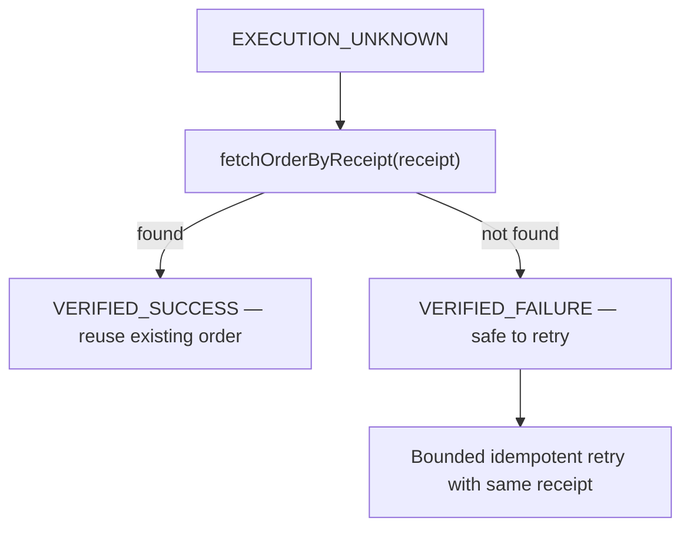

# What Broke, and How We Got Out

> This is the story Razorpay reads first.

---

## 1. The Razorpay Amount Bug — ₹1,500 became ₹15

**When**: Mid-build, during the first live Razorpay test-mode integration.

**What happened**: PolicyShield created a Razorpay order for a ₹1,500 product. The Razorpay Dashboard showed ₹15. The deterministic gate had approved the correct amount, the audit trail logged the correct amount, but the Razorpay API received `1500` when it expected `150000` (paise).

**Root cause**: Razorpay's API expects amounts in **paise** (1 INR = 100 paise). The executor was passing rupees directly.

**How we got out**:
```diff
- const amountInPaise = parameters.amount;
+ const amountInPaise = Math.round(amountInRupees * 100);
```

Added the `amount_conversion.test.ts` test to ensure this never regresses. The fix is one line, but missing it would have silently created incorrect orders in production.

**Commits**: `534ec8c`, `8aae8a0`

---

## 2. The EXECUTION_UNKNOWN Recovery Spiral

**When**: Building the webhook recovery path.

**What happened**: When a Razorpay API call timed out, the system correctly transitioned to `EXECUTION_UNKNOWN`. But the recovery scan on startup would try to verify the order, fail, and then retry — creating a second order. Now there were *two* Razorpay orders for the same intent.

**Root cause**: The recovery path was using `createOrder` as a "retry" instead of first checking whether the original order existed using the `external_receipt` correlation ID.

**How we got out**: Implemented a verify-before-retry pattern:



Added exponential backoff (1s → 2s → 4s) for the verification attempts, because Razorpay's API might not immediately reflect a just-created order.

**Commits**: `4850aba`, `23aeab0`, `f8c6d4a`

---

## 3. The CI That Wouldn't Stop Failing

**When**: Every push for about 2 weeks.

**What happened**: The CI pipeline failed in 14 different ways across 20+ commits. A selection:

| Failure | Root Cause |
|:---|:---|
| `TS6305` — shared package not found | Build ordering: `shared` must compile before `backend` |
| `vitest` importing compiled `dist/` | Added `exclude: ['**/dist/**']` to vitest config |
| `passWithNoTests: true` hiding broken tests | Flipped to `false` — CI must fail if no tests run |
| Vite Rolldown native dependency crash | Pinned Vite version, added explicit prebuild step |
| `SERIAL PRIMARY KEY` errors in tests | Schema is dual-mode (PostgreSQL prod, SQLite test) — SQLite silently accepts `SERIAL` |
| `better-sqlite3` C++ build failure on CI | Fixed Node.js version to 20.x with `cache: 'npm'` |

**How we got out**: Stopped trying to fix CI blindly and instead:
1. Made the CI env match local exactly: `NODE_ENV=test`, `STUB_AI=true`, `STUB_RAZORPAY=true`, `DB_PATH=:memory:`
2. Used `pool: 'forks'` in vitest for `better-sqlite3` process isolation
3. Excluded eval scripts from TypeScript compilation (they use `tsx` directly)

**Commits**: `e6a466e`, `66358c1`, `bed712d`, `bff2a1a`, `9be644a`, `324afea`, `8879310`, `ad0ee34`, `c96fc43`

---

## 4. The Postgres Migration at 2 AM

**When**: After deploying to Render with SQLite on a persistent disk.

**What happened**: SQLite on Render's persistent disk worked, until it didn't. Write-ahead logging (WAL mode) combined with Render's filesystem caused random `SQLITE_BUSY` errors under concurrent SSE connections. The decision: migrate to PostgreSQL (Neon) in production while keeping SQLite for tests.

**Root cause**: SQLite is single-writer. With multiple SSE connections polling `agent_events`, the WAL lock was contended.

**How we got out**: Built a `PgWrapper` class that wraps the `pg` Pool with the same `prepare().run()/get()/all()` interface as `better-sqlite3`. This let the entire codebase work with both databases without changing any query code:

```typescript
// client.ts — dual-mode database
if (isTest) {
  // SQLite for fast, isolated tests
  sqliteDb = new Database(process.env.DB_PATH || ':memory:');
} else {
  // PostgreSQL for production
  pool = new Pool({ connectionString: process.env.DATABASE_URL });
}
```

But it wasn't clean. PostgreSQL returns `{ count: '5' }` (string) while SQLite returns `{ count: 5 }` (number). Every `COUNT(*)` query had to be wrapped with `Number()`. PostgreSQL column aliases are case-sensitive; SQLite isn't. The `sequence` column in `agent_events` broke because PostgreSQL returned it as `Sequence`.

**Commits**: `1eb88d3`, `8c73b74`, `5176540`, `2ac5fff`

---

## 5. The LLM Proposing 80% Discounts

**When**: First Gemini integration test.

**What happened**: The AI agent, given a buyer intent like "I want the cheapest laptop with maximum discount", proposed an 80% discount. The policy allowed 15% max. The proposal looked perfectly reasonable in the AI's response — structured JSON, high confidence, clear reasoning. It just violated the merchant's hard rule.

**Why this matters**: This is the *entire thesis* of PolicyShield. The LLM proposes; the deterministic gate decides.

**How the system handled it**:
```
PROPOSE (80% discount) → POLICY_REJECT → ADAPT → PROPOSE (15%) → APPROVE
```

The adaptation loop ran once. The gate caught it. The final action respected the 15% ceiling. The audit trail shows both the original proposal and the rejection reason. This is working as designed, but seeing it happen live — with a real LLM — was the moment the architecture proved itself.

**Commits**: `c8badd8`, `89223f9`, `e51f533`

---

## 6. The SSE Race Condition

**When**: After deploying the React frontend.

**What happened**: The buyer submits an intent → the frontend immediately opens an SSE connection to `/api/v1/runs/:id/stream` → but the `agent_runs` row hasn't been inserted yet → 404 → the UI shows nothing.

**Root cause**: `POST /api/intent` returns `202 Accepted` with the `run_id` *before* the orchestrator has inserted the `agent_runs` row (the orchestration runs async).

**How we got out**: Added a retry-with-backoff in the SSE route — if the run doesn't exist yet, wait 200ms and try again (max 3 attempts). If it still doesn't exist, return 404. This gives the orchestrator time to initialize.

```typescript
// stream.routes.ts — wait for run to be initialized
let run = null;
for (let attempt = 0; attempt < 3; attempt++) {
  run = await db.prepare('SELECT * FROM agent_runs WHERE agent_run_id = ?').get(runId);
  if (run) break;
  await new Promise(r => setTimeout(r, 200));
}
```

**Commits**: `8be2a37`

---

## The Pattern

Every failure above follows the same shape:

1. **Something breaks silently** — amounts are wrong, orders duplicate, state is stale
2. **The system's safety boundaries catch it** — the deterministic gate, the idempotency check, the state machine
3. **The audit trail proves what happened** — every transition is logged, every rejection has a reason code

The architecture isn't clever. It's paranoid. And that's the point.
